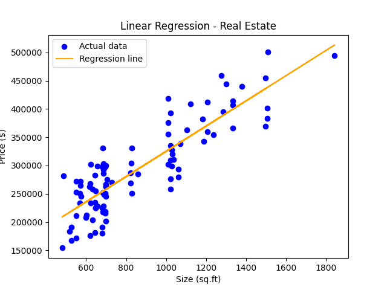

# 🏠 Real Estate Price Prediction

This project demonstrates how to use **Simple Linear Regression** to predict apartment prices based on their size (in square feet).  
It is built as a hands-on exercise to practice foundational machine learning techniques using Python and scikit-learn.

---

## 📌 Project Goals

- Load and explore structured data with `pandas`
- Build a linear regression model using `scikit-learn`
- Understand model outputs: intercept, coefficient, and R² score
- Predict price for new input (e.g. 750 sq.ft)
- Visualize the regression line vs actual data points with `matplotlib`

---

## 🧪 Model Summary

**Regression Equation:**  
`price = 223.18 × size + 101,912.60`

**Performance:**  
- R² Score: `0.7447`
- Prediction for 750 sq.ft apartment: **\$269,906.66**

---

## 📊 Visualization

---

## 📁 Dataset

The dataset (`real_estate_price_size.csv`) contains two columns:
- `size` → apartment size in square feet  
- `price` → apartment price in USD

This is a small, educational dataset designed for learning and practice.

---

## 🧠 What I Learned

As someone transitioning into data analytics, this project helped me:

- Practice model fitting and data reshaping for regression  
- Understand how each square foot affects pricing  
- Interpret R² and coefficients in a real-world context  
- Use `matplotlib` to clearly visualize model results  
- Organize a complete project in a professional format

---

## 🚀 Future Enhancements

- Add more features (e.g. location, room count)  
- Explore residuals and model assumptions  
- Use train/test split and cross-validation for evaluation

---

## 👩‍💻 About Me

Hi, I'm **Gülsarə Mirzəyeva** — passionate about learning data science step by step.  
This is one of my early projects applying regression from scratch using Python.

📫 [LinkedIn Profile](https://www.linkedin.com/in/gulsara-mirzayeva-298a3b359/)  
📧 Email: mirzayeva.gulsare@gmail.com
